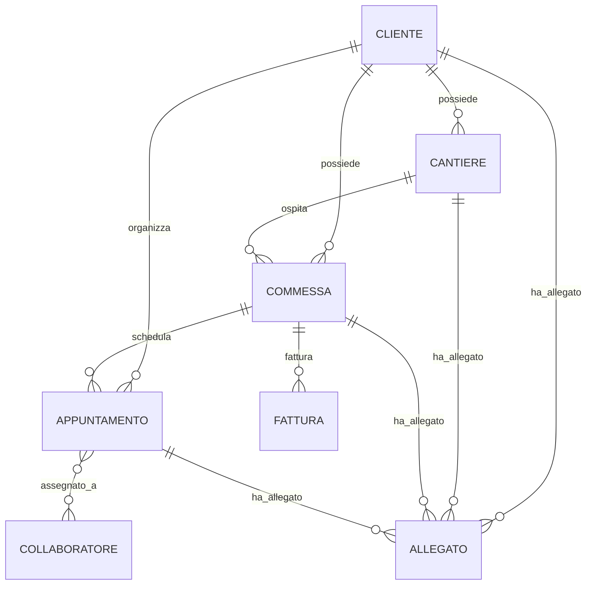

# Blueprint: Architecture & Database (V2 Rewrite)

## 1. Il Paradigma del "Grafo Flessibile"

A differenza dei sistemi gestionali tradizionali ad albero rigido (es. _Azienda -> Filiale -> Contatto_), il dominio gestionale di GS Pose richiede massima flessibilità operativa.
Il sistema si basa su una architettura modellata come **Grafo Flessibile**, dove le entità primarie possono:

- Nascere slegate e totalmente indipendenti (Modello Orfano).
- Essere connesse successivamente a un genitore.
- Cambiare genitore.
- Essere scollate dal genitore senza essere eliminate (Comportamento Svincolo).

### 1.1 Entità del Dominio

- **Cliente** (`cliente`): L'entità di business principale.
- **Cantiere (Indirizzo)** (`indirizzo`): Luogo fisico dell'intervento.
- **Commessa** (`commessa`): L'entità che traccia un ordine di lavoro e gli stati finanziari/operativi.
- **Appuntamento** (`appuntamento`): Evento a calendario che richiede la presenza di Collaboratori.
- **Fattura** (`fattura`): Documento contabile.
- **Allegato** (`allegato`): File fisico caricato nel sistema, ricollegabile ovunque.
- **Collaboratore** (`collaboratore`): Utente interno dell'azienda (operatore, installatore, admin) con credenziali di accesso.

### 1.2 ER Diagram (Modello Concettuale)

_Tutti i rami sono "Zero-to-Many" (`o{`) indicando l'opzionalità della relazione e permettendo il modello Orfano._

---

## 2. Regole di Gestione del Database (PostgreSQL)

Il database target DEVE essere **PostgreSQL** in virtù della sua ottimizzazione per vincoli complessi e la ricerca full-text nativa. L'ORM di riferimento è TypeORM.

### 2.1 Vincoli e Nullability

- **Relazioni Padre `Nullable`**: Nelle entity `.ts`, tutte le colonne relazionali `ManyToOne` che puntano verso l'alto DEVONO avere `nullable: true` (es. `clienteId` in Cantiere, `indirizzoId` in Commessa).
- **Soft Delete Universale**: Ogni singola tabella DEVE avere una colonna `deletedAt` (Tipo `timestamp` nullable, gestita con `@DeleteDateColumn`). Il database NON DEVE MAI distruggere nativamente record di business, tranne gli `Allegati` fisici se espressamente richiesto, per evitare problemi legali o perdita di tracciatura contabile.
- **Timestamp Tracking**: Ogni riga DEVE esporre intrinsecamente `createdAt` e `updatedAt`.

### 2.2 Transazionalità (ACID)

Per le operazioni miste, i Services del back-end DEVONO impiegare le transazioni (QueryRunner via DataSource).

- _Scenario_: Modifica genitore di una Commessa + re-calcolo del bilancio cliente.
- _Regola_: Nessuna operazione DEVE essere scritta parzialmente. In caso di errore a metà blocco, va emesso un `await queryRunner.rollbackTransaction()`.

### 2.3 Eliminazione Logica - Albero delle Decisioni

L'API REST esporrà per le DELETE un parametro in query string: `?cascade=true|false`.

1. **Cascade = False (Modalità Orfano / Predefinita)**
   - _Azione DB_: Esegue il Soft Delete _esclusivamente_ sull'entità target (es. Dettaglio Cantiere -> Elimina Cantiere).
   - _Gestione Figli_: I figli diretti (es. Commesse del quel cantiere) NON vengono eliminati. Il Service entra in transazione e asporta le foreign key: `UPDATE commessa SET indirizzoId = NULL WHERE indirizzoId = :id`.
2. **Cascade = True (Modalità Nucleare)**
   - _Azione DB_: Soft Delete dell'entità target e dei figli diretti in cascata ricorsiva (es. Elimina Cantiere -> Elimina le sue Commesse -> Elimina gli Appuntamenti di quelle commesse).
   - _Eccezione Allegati_: Se si incontra un Allegato durante l'eliminazione a cascata, l'Record DEVE essere `HARD DELETED` dal database (rimozione fisica da PostgreSQL) e simultaneamente il filesystem DEVE invocare `fs.unlinkSync()`.

---

## 3. Ottimizzazione Indici

Per garantire performance sulla rotta `/paginated` di default:

- Le chiavi esterne (`clienteId`, `indirizzoId`, ecc.) DEVONO possedere un indice, anche se PostgreSQL non li crea in automatico come MySQL. Definire `@Index()` nelle entities TypeORM.
- Le colonne testuali più ricercate (es. `nome` Cliente, `seriale` Commessa, `titolo` Appuntamento) DEVONO avere indici di tipo testuale standard (`B-tree` o `GIN/GiST` per full-text esplicita qualora il DB crescesse sensibilmente).
